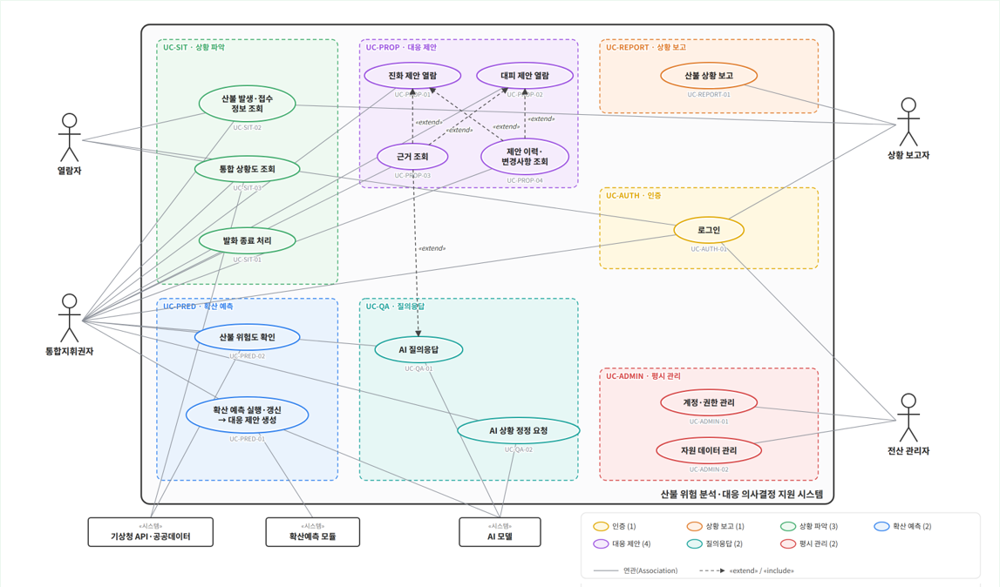

# 산불 대응 AI 의사결정 지원 시스템 — 목업 v3 요구사항 명세 (요구사항분석서 기준)

- 대상: 이 저장소의 정적 웹 목업(`index.html`, `app.js`, `data*.js`). 산불 확산 예측 결과를 표준매뉴얼 근거와 연결해 통합지휘권자에게 진화·대피 조치를 제안하는 의사결정 지원 화면.
- 기준 문서: 요구사항분석서 최종본(`5조_분석서_산불대응AI_황승준.pptx`, 106쪽)과 2026-10-11 회의 정정 사항(v3 화면 개편, 2.2). 기능 F-01~F-32, 유스케이스 15개(UC-AUTH-01, UC-REPORT-01, UC-SIT-01~03, UC-PRED-01~02, UC-PROP-01~04, UC-QA-01~02, UC-ADMIN-01~02), 권한 4종(조작·열람·보고·관리). 이 README의 ID·용어는 그 문서와 같다.
- 시연 시나리오: 2025-03-22 경북 의성군 안평면 괴산리 산불, 기준시각(t0) 12:00, 발생 후 8시간(1시간 간격 P1~P8).
- 열어 보기: `index.html`을 정적 서버로 열거나(예: `python -m http.server`) GitHub Pages 주소로 접속. 온라인 필요(지도 타일).
- 시연 계정(비밀번호 `1234`): `cmd01` 통합지휘권자 · `view01` 열람자 · `rep01` 상황 보고자 · `admin01` 전산 관리자. 로그인 화면에서 사용자 구분을 바꾸면 그 구분의 계정이 자동으로 채워진다(화면에는 계정 안내를 두지 않는다). 아이디·비밀번호·구분이 발급 계정과 맞지 않으면 진입하지 않는다.
- 실패·병합 장면(개발용, 화면 버튼 없음): 주소 뒤에 `?fail=weather,predict,proposal,risk,riskvars,resources,chat`(필요한 것만 쉼표로)를 붙이면 기상·확산 예측·대응 제안·위험도·위험도 변수 일부·진화자원·AI 답변을 못 가져온 장면을, `?merge=1`을 붙이면 P5가 겹쳐 병합된 산불 장면을 볼 수 있다. 같은 설정은 `data.js`(`weather.fetch_status`, `prediction_demo`, `risk_model.mock_fail_next`·`mock_missing_vars`, `resources_fetch_status`, `chat_demo`, `risk_merge_demo.enabled`)에도 있다.
- 표기: 각 기능의 **상태** 열은 목업에서 실제로 계산·동작하면 「동작」, 미리 정한 값·대본으로 흉내내면 「연출」, 실서비스에서 다른 구성요소로 바뀌면 괄호에 적었다.
- 화면 구성은 산림청 산불상황관제시스템·GPS단말기 로그인·항공기 위치추적 화면을 참고했다. 화선은 합성 모델이고 일부 값은 가상이다(부록 A).

---

## 1. 시스템 정의와 액터

### 1.1 정의

산불 발생 직후부터 진화·대피 판단이 이어지는 8시간 안팎의 대응 과정에서 산불현장 통합지휘권자(시장·군수·구청장)에게 통합 상황도와 판단 항목별 대응 제안서를 표준매뉴얼 근거와 함께 제공하는 웹 대시보드다. ① 상황 보고자가 발화 정보와 실측 화선을 보고하면, ② 통합지휘권자가 확산 예측을 실행해 1시간 간격 확산 범위(P1~P8)를 만들고, 규칙 엔진이 경계값·수치가 있는 값(대응단계·위험구역·대피소 배정 등)을 판정한 뒤 AI 모델이 그 판정 값과 매뉴얼 근거로 진화 7개(S1~S7)·대피 7개(E1~E7) 항목의 제안 문장을 쓴다. ③ 통합지휘권자는 AI 어시스턴트에 질문하거나 상황 변화를 정정해 제안서를 다시 받고, 진화가 끝나면 발화 종료 처리를 한다. 열람자는 통합 상황도와 발생·접수 정보만 본다. 평시에는 전산 관리자가 계정·권한과 진화자원 데이터를 관리한다. 시스템은 권고만 하며 최종 결정은 통합지휘권자가 내린다.

### 1.2 액터

| 액터 | 종류 | 권한 | 목업에서 쓰는 화면 |
|---|---|---|---|
| 통합지휘권자 | 사람(주 액터) | 조작. 예측 실행, 위험도·제안·근거·이력 검토, AI 질의·상황 정정, 발화 종료 처리. 발화 정보를 직접 입력하지 않는다 | 왼쪽 고정 창(산불현황·대응제안) + 지도(위험도 네모, 확산 예측 실행·재생), 진화자원 창, 이벤트 로그 창, AI 어시스턴트 |
| 열람자 | 사람 | 열람. 유관기관·상급 본부 담당자로 통합 상황도와 발생·접수 정보를 보기만 한다(제안·위험도·이력·AI 어시스턴트는 보이지 않음) | 왼쪽 고정 창(산불현황) + 지도(시간별 확산 재생), 진화자원 창 |
| 상황 보고자 | 사람(입력 전담) | 보고. 산불 최초 보고(발화 위치·발생 일시·신고 내용·접수 시각·기관별 접수 기록)와 1시간마다 실측 화선 보고. 예측 실행·제안 열람·정정은 하지 않는다 | 왼쪽 고정 창(상황 입력 판) + 지도 |
| 전산 관리자 | 사람(평시) | 관리. 계정 발급·회수·권한 지정·잠금 해제, 진화자원 데이터 관리 | 관리 화면(지도 없음) |
| 확산예측 모듈 | 시스템 | 실측 화선(없으면 발화점)·기상·지형·연료로 1시간 간격 누적 확산 범위 P1~P8 계산(목업은 합성 타원 모델, 실서비스는 ELMFIRE) | UC-PRED-01 |
| AI 모델 | 시스템 | 규칙 엔진 판정 값(바꾸지 않음)과 확산 범위 안 마을·시설·자원 데이터, 검색한 표준매뉴얼 근거로 제안 문장·답변을 쓰고 정정 입력을 해석(목업은 규칙 템플릿·키워드 대본, 실서비스는 EXAONE 4.0 32B + KURE-v1 근거 검색) | UC-PRED-01, UC-QA-01, UC-QA-02 |
| 기상청 API·공공데이터 | 시스템 | 풍향·풍속·습도 등 기상과 마을·시설·도로·지형 공간 데이터(목업은 고정값·OSM·SGIS 파일) | UC-SIT-03, UC-PRED-02(UC-PRED-01에서도 기상 사용) |

- 계정은 전산 관리자가 발급하며 권한은 조작(통합지휘권자)·열람(열람자)·보고(상황 보고자)·관리(전산 관리자)로 나뉜다. 관리 권한 계정은 설치 시 사전 발급한다.
- 상단에는 아이디·사용자 구분·권한만 보인다. 책임자의 직위·관할은 표시하지 않는다.

### 1.3 화면 구성

| 영역 | 내용 | 관련 UC |
|---|---|---|
| 로그인 화면 | 정부 상징·산림청·시스템명 헤더(현재 시각 KST), 소개 패널, LOGIN 폼(아이디·비밀번호·사용자 구분), 공지사항 | UC-AUTH-01 |
| 상단 1줄 | 시스템명, 현재 시각(KST), 「진화자원」 창 토글, 빨간 「이벤트 로그」 버튼(통합지휘권자), 사용자(아이디 · 구분(권한))·로그아웃 | UC-SIT-03, UC-PROP-04 |
| 상단 2줄(회색) | 왼쪽: 레이어 버튼 묶음 예측(화선·위험구역) / 인구(마을·주택) / 시설(취약시설·국가유산·대피소·담수지·송전선·유관기관) / 도로(도로·철도·대피로). 오른쪽: 「확산 예측 실행」(통합지휘권자, 결과가 있으면 「다시 예측」, 실행 중 「예측 중 n%」), 예측이 있으면 옆에 시간별 확산 재생(재생·처음으로·시간 막대·재생 시각·속도) | UC-SIT-03, UC-PRED-01 |
| 지도 | 위성영상(Esri) + 지명·도로 라벨(OpenFreeMap), 의성군 테두리(노란 굵은 선), 발화점, 실측 화선(진홍), 예측 범위 P(t)·위험구역(P5)·잠재 위험구역(P8), 아이콘 마커, 오른쪽 위 산불 위험도 네모(통합지휘권자, 숫자만), 오른쪽 아래 도구줄(확대·축소·범위 맞춤·위성/일반)·나침반·좌표, 지도 출처는 i 아이콘(마우스를 올리면 펼침) | UC-SIT-03, UC-PRED-02, UC-REPORT-01 |
| 왼쪽 고정 창(화면 너비 25%, 최소 340px, 이동·닫기 없음) | 맨 왼쪽 빨간 「산불」 날개 → 고정 창 위로 산불 목록(접수·진행 중 / 종료)이 펼쳐짐. 머리(산불명·진행상태·발화점으로 이동), 탭 2개: 산불현황(발생 장소·발화 위치·발생 일시·신고 접수·신고 내용·접수 기록·진행상태·공식 단계·기상·실측 화선·예측 면적을 한 표로, 「종료 처리」) / 대응제안(통합지휘권자: 제안서·진화/대피·구분 필터, 아래에 「제안서 버전 이력」 펼침). 근거 창은 고정 창 위에 열림 | UC-SIT-01·02·03, UC-PROP-01~04 |
| 상황 입력 판(상황 보고자, 왼쪽 고정 창) | 「새 산불 보고」·「실측 화선 보고」, 산불명·주소·발화 위치(지도 지정)·발생 일시·신고 접수 일시·신고 내용, 기관별 접수 기록(기관·시각·경로), 실측 화선(지도에서 그리기 / GeoJSON, 새 버전 또는 정정), 저장. 산불 목록은 「산불」 날개 | UC-REPORT-01, UC-SIT-02 |
| 떠 있는 창 | 진화자원 현황(대기·투입·정비 체크박스), 이벤트 로그, 산불 위험도 팝업(위험도·4요소 점수·가중치 → 「요소별 지표」), AI 어시스턴트 팝업(우측 하단 버튼), 모달(요소별 지표 23개 변수 표·종료 처리 확인·상황 정정 확인·제안 변경사항·변경 내용·GeoJSON·계정 발급 결과), 실패 시스템 알림(지도 위쪽 가운데, 약 4초 뒤 사라짐) | UC-SIT-03, UC-PRED-02, UC-PROP-03·04, UC-QA-01·02 |
| 관리 화면(전산 관리자) | 헤더(현재 시각 KST·로그아웃), 계정·권한 관리 표(발급·회수·재발급·권한 변경·잠금 해제·삭제), 진화자원 데이터 관리 표(등록·수정·삭제) | UC-ADMIN-01·02 |

---

## 2. 기능 요구사항과 목업 구현

번호는 요구사항분석서 기능 목록(F-01~F-32)을 따른다.

| 번호 | 기능 | 목업 구현 | 화면 위치 | UC | 상태 |
|---|---|---|---|---|---|
| F-01 | 로그인·계정·권한 관리 | 잠금 여부를 먼저 확인하고 아이디·비밀번호·사용자 구분을 계정 목록과 대조해 모두 맞을 때만 진입. 틀리면 「아이디 또는 비밀번호가 올바르지 않습니다」와 실패 횟수 +1, 회수 계정이면 「회수된 계정입니다. 전산 관리자에게 문의하십시오」, 5회 연속 실패하면 잠금(「계정이 잠겼습니다. 전산 관리자에게 문의하십시오」). 로그인하면 권한을 담은 세션 토큰을 발급하고(목업은 시간 만료 없음), 토큰이 있으면 새로고침해도 바로 진입. 관리자가 계정 발급(아이디·초기 비밀번호 시스템 생성)·회수·재발급·권한 변경·잠금 해제·삭제 | 로그인 화면, 관리 화면 | UC-AUTH-01, UC-ADMIN-01 | 동작(토큰은 브라우저 세션 저장소. 실서비스는 JWT, SER-001) |
| F-02 | 산불 상황 보고(발화 정보·실측 화선) | 「새 산불 보고」로 발화 위치(지도 지정 또는 좌표)·발생 일시(선택)·신고 접수 일시·신고 내용·기관별 접수 기록(기관·시각·경로)을 입력하면 산불이 '접수'로 생성. 실측 화선은 지도에서 꼭짓점을 찍어 그리거나 GeoJSON으로 입력(초기대응에서는 생략 가능). 첫 실측 화선이 저장되면 '진행 중'. 화선 v1은 발화점이므로 실측 화선은 v2부터 쌓인다. 「실측 화선 보고」는 직전 화선을 불러와 새 버전(v3, v4 …)으로 제출하고, 「정정」을 고르면 이전 버전을 '정정됨'으로 보존. 이미 예측이 있으면 「재예측 필요」 표시 | 상황 입력 판 | UC-REPORT-01 | 동작 |
| F-03 | 발화 종료 처리 | '진행 중' 산불에만 「종료 처리」 → 「종료하면 상황 보고·예측 실행·상황 정정이 막힙니다」 확인 → 종료 상태·종료 시각·처리자 저장. 진행 중 목록에서 빠져 「종료」 목록으로 옮겨지고, 이후 보고·예측·정정 차단, 제안서·이력은 조회만 | 산불현황 탭 | UC-SIT-01 | 동작 |
| F-04 | 산불 발생·접수 정보 조회 | 「산불」 날개의 산불 목록(기본 「접수·진행 중」, 「종료」로 바꾸면 종료 목록)에서 선택 → 산불현황 탭 한 표에 발생 장소·발화 위치·발생 일시·신고 접수·신고 내용·기관별 접수 기록·진행상태·공식 단계·기상·최신 실측 화선 버전·입력 시각, 지도 이동 | 「산불」 날개, 산불현황 탭 | UC-SIT-02 | 동작(접수 기록 일부는 시연값) |
| F-05 | 통합 상황도 | 발화점·실측 화선·1시간 간격 예측 범위(재생 시각까지 채움, 다음 1시간 점선)·위험구역(P5)·잠재 위험구역(P8)과 마을·시설·도로, 의성군 테두리, 기상(현재값·수신 시각)을 한 화면에 표시. 종료된 산불은 P1~P8 없이 발화점·실측 화선만 | 지도, 산불현황 탭, 상단 2줄 재생 | UC-SIT-03 | 동작 |
| F-06 | 지도 레이어 선택 | 예측·인구·시설·도로 묶음별 버튼으로 켜고 끔(읍면 경계·진화대 레이어 없음, 의성군 테두리는 항상 표시) | 상단 2줄 | UC-SIT-03 | 동작 |
| F-07 | 주요 시설 지도 표시 | 마을·취약시설·국가유산·대피소·담수지·유관기관 아이콘. 마커를 누르면 이름·종류만 팝업. 발화점 거리는 표시하지 않음 | 지도 | UC-SIT-03 | 동작 |
| F-08 | 가용 현황 확인 | 헬기·차량·인력 현황. 대기·투입·정비 체크박스로 거름(처음에는 셋 다 체크), 위쪽 합계 칸은 체크한 상태만 열로 표시. 관리자 등록값과 AI 정정(헬기 N대 투입 등)이 반영. 못 가져오면 경고 아이콘과 「진화자원 정보를 가져오지 못했습니다」 | 상단 「진화자원」 → 떠 있는 창 | UC-SIT-03 | 연출(자원 수·호출부호 가상) |
| F-09 | 확산 예측 실행·갱신 | 통합지휘권자가 누를 때만 실행(자동 실행 없음). 최신 실측 화선(없으면 발화점)·기상으로 P1~P8 산출(실측 폴리곤을 포함하도록 확장) → 규칙 판정 → 위험도 계산 → 진화·대피 제안서 새 버전 생성. 결과가 있으면 버튼이 「다시 예측」, 옆에 시간별 확산 재생. 실패하면 이전 결과를 유지하고 시스템 알림과 버튼 옆 경고 | 상단 2줄 오른쪽 | UC-PRED-01 | 연출(합성 타원 모델. 실서비스는 ELMFIRE) |
| F-10 | 산불 위험도 조회 | 예측 1회마다 P5 기준 위험도 1개 = Σ(가중치 × 변수 등급 1~5) ÷ Σ가중치, 1.00~5.00 숫자만(등급 이름·매핑 없음, 「R」 표기 없음). 위험도 기준 CSV 25개 변수 중 경사도_down·도로 및 교통(접근성)을 뺀 23개, 가중치는 0.94로 나눠 표시(기상 0.372·지형 0.287·연료 0.266·인프라 0.074). 지도 오른쪽 위 네모에 숫자 → 누르면 위험도·4요소 점수·가중치 팝업 → 「요소별 지표」(또는 요소 줄)를 누르면 23개 변수 표 팝업(변수명 · 값 · 단위 · 가중치 · 위험도). 예측 전·종료된 산불은 네모를 숨김. 못 가져온 변수는 빼고 계산하고 표에 경고 | 지도 오른쪽 위(통합지휘권자) | UC-PRED-02 | 연출(변수 값은 시연값, 시나리오 1회차 3.20·2회차 3.51. 실서비스는 P5 폴리곤과 격자 자료 겹침) |
| F-11 | 대응 제안 생성·갱신·상세 조회 | 예측 실행·상황 정정 때 새 버전 생성(사유 2종: 예측 갱신 / 상황 정정). 버전은 v(화선 버전).(대응 생성 버전) — 예: 발화점(화선 v1) 기준 v1.1, 실측 화선 v2 기준 첫 제안 v2.1, 상황 정정 후 v2.2, 새 실측 화선 v3 보고 후 재예측 v3.1. 항목마다 제안 문장이 보이고, 누르면 판정 이유·대상·권한·근거가 펼쳐짐. 발동하지 않은 항목과 근거 없는 제안은 제안서에 넣지 않음 | 대응제안 탭 | UC-PRED-01, UC-PROP-01·02 | 동작(판정) / 연출(문장 템플릿. 실서비스는 EXAONE + RAG) |
| F-12 | 제안 분류 | 진화(S1~S7) / 대피(E1~E7) 탭과 즉시·대기·협의·요청 필터, 구분별 건수, 「7항목 중 발동 n」 | 대응제안 탭 | UC-PROP-01·02 | 동작 |
| F-13 | 대응 근거 조회 | 제안 문장·근거 목록·AI 답변의 [k]를 누르면 근거 창에 해당 문장과 표준매뉴얼 문서·쪽수·조항·요약 표시 | 근거 창 | UC-PROP-03 | 동작(쪽수 기준 요약) |
| F-14 | 제안 이력·변경사항 조회 | 버전(최신 표시)·생성 시각·생성 계기·구분 건수·변경 건수 표. 「보기」로 이전 버전 열람(「이전 버전」 배지), 「비교」로 직전 버전 대비 변경, 항목의 '변경' 태그를 누르면 그 항목의 이전 → 이후 문장 팝업 | 대응제안 탭 아래 「제안서 버전 이력」, 모달 | UC-PROP-04 | 동작 |
| F-15 | S1 대응단계 판단·격상 검토 | 4요소(예상 피해면적·평균풍속·예상 진화시간·시설피해) 각각의 단계를 판정하고 가장 높은 단계를 공식 단계와 비교. 높으면 「협의」로 격상 검토 권고와 지휘권 인계 안내(제안 상단 배너). 예상 진화시간은 상황 정정 값 | 대응제안 탭 | UC-PRED-01, UC-PROP-01 | 동작(구간값은 시행령 별표를 2026 체계에 대응시킨 목업 근사) |
| F-16 | S2 진화 우선지역·보호대상 선정 | P5 내 인명(마을·취약시설) → 국가유산·송전선 → 주택 순 | 〃 | 〃 | 동작 |
| F-17 | S3 진화자원 투입·배분·재배치 | 주 확산 방향 구역 우선 배치, 가용 헬기 집중 투입. 추가 헬기 대수는 비표시(칸에 「근거가 부족하여 표시하지 않았습니다」, 이벤트 로그에 근거 부족) | 〃 | 〃 | 동작 |
| F-18 | S4 진화 방식·시간대 전략 | 현재 풍속의 헬기 운용 가능 여부, 최대 풍속 시간대, 일몰 후 집중 진화 | 〃 | 〃 | 동작 |
| F-19 | S5 시설 보호 조치 | P5 내 주택군 소방차 배치·예비 살수, 송전선 통과 시 한전 요청 | 〃 | 〃 | 동작 |
| F-20 | S6 유관기관 동원·협조 요청 | 걸친 시·군·구와 지휘권 인계 필요성, 인접 시·군·소방·경찰·군 동원 요청. 요청 수량은 비표시(근거 부족 안내·로그) | 〃 | 〃 | 동작 |
| F-21 | S7 진화인력 안전·투입 관리 | P5 내 작업 조 수, 풍상측 퇴로, 최대 풍속 시간대 전방 투입 제한 | 〃 | 〃 | 동작 |
| F-22 | E1 위험구역 설정 | 화선 도달 ≤5h 마을 위험구역(즉시), ≤8h 잠재 위험구역(대기) | 〃 | UC-PRED-01, UC-PROP-02 | 동작 |
| F-23 | E2 대피 대상·순서·시점 결정 | 도달 시각·고령자 순 대피 순위, 야간 도달 마을 일몰 전 사전대피, 대피 완료 마을 제외, 명령 발령 후 미대피 확인 | 〃 | 〃 | 동작 |
| F-24 | E3 취약시설·미대피 주민 조치 | 확산 범위 내 취약시설 별도 이송, 미대피 주민 강제 대피 | 〃 | 〃 | 동작 |
| F-25 | E4 대피소 배정·분산 | P8 범위 밖 대피소에 마을 인구를 최근접 순 배정, 수용 초과 시 분산, 범위 안 대피소 제외 | 〃 | 〃 | 동작 |
| F-26 | E5 대피 경로·교통통제 | 대피로·진입로 겹침 구간 경찰 통제 요청, 겹침 구간 화선 도달 시각 | 〃 | 〃 | 동작(겹침 구간은 시나리오 고정) |
| F-27 | E6 재난문자·방송 전파 제안 | 확산 범위 읍면동에 대피 명령 단계 CBS·DITS 송출, 송출 이력 반영 | 〃 | 〃 | 동작 |
| F-28 | E7 인명구조·긴급구조 요청 | 부상·고립 보고가 있으면 소방 긴급구조통제단 요청 | 〃 | 〃 | 동작 |
| F-29 | AI 질의응답 | 대피 순서·헬기 운용·격상 기준·대피소·추가 헬기 대수·위험도·야간·송전선·재난문자·교통통제·취약시설·자원·현재 상황·근거 질문에 상황값을 넣어 답하고 근거 번호를 붙임(상황·제안은 바뀌지 않음). 빠른 질문 6개. 항목의 「이 항목 질문」으로 맥락 지정. 상황 변화로 판별된 입력은 정정 확인 카드로 넘김 | AI 어시스턴트 팝업 | UC-QA-01 | 연출(키워드 대본. 실서비스는 EXAONE + RAG) |
| F-30 | AI 상황 정정 요청 | 「상황 정정」으로 대피 완료·부상/고립·헬기/소방차/진화인력 투입 수·예상 진화시간·대피명령·재난문자·공식 단계·위기경보 변화를 입력 → 대상·항목·이전·변경 확인 카드 → 저장 후 예측은 그대로 둔 채 제안서 새 버전 생성, 「제안 변경사항」 창 | AI 어시스턴트 팝업 → 확인 모달 | UC-QA-02 | 동작(해석은 정규식) |
| F-31 | 진화자원 데이터 관리 | 헬기·차량·인력 단위를 구분·명칭(호출부호)·소속·수량(필수)과 배치 위치·상태(투입·대기·정비)로 등록·수정·삭제. 필수 값이 빠지면 저장을 막고 빠진 칸 표시. 투입 중 자원은 삭제 불가 | 관리 화면 | UC-ADMIN-02 | 동작(메모리 안에서만 유지) |
| F-32 | 이벤트 로그 | 시스템(로그인·로그아웃·잠금)·입력·예측·제안·근거 부족·정정·종료·관리(계정·진화자원 변경) 구분으로 시각·구분·내용·사용자를 추가 전용 기록, 읽기 전용 열람 | 상단 빨간 「이벤트 로그」 → 떠 있는 창 | UC-PROP-04 | 동작 |

### 2.1 요구사항분석서와 맞추며 바꾼 것(2026-10-05)

| 구분 | 이전 목업 | 지금 |
|---|---|---|
| 삭제 | 「제안 다시 생성」 버튼(수동 재생성, 사유 「수동 갱신」) | 제거. 제안서는 예측 실행·상황 정정 때만 생긴다 |
| 삭제 | 열람자 로그인 시 예측·제안 자동 생성 | 제거. 예측은 통합지휘권자가 누를 때만 실행 |
| 삭제 | 열람자의 대응제안·이력·위험도 탭 | 숨김. 열람자는 산불현황·통합 상황도(시간 재생 포함)·진화자원만 |
| 삭제 | 진화율(산불현황 표, 종료 시 100%, 정정 「진화율 30%」, 답변) | 제거 |
| 삭제 | 제안 상세의 「충돌」 칸 | 제거(충돌은 내부 검증용, 화면에 표시하지 않음) |
| 삭제 | 「해당 없음 N건 보기」 | 제거. 발동한 항목만 제안서에 넣고 「7항목 중 발동 n」만 표시 |
| 삭제 | 30분 무조작 자동 로그아웃 | 세션 토큰 만료 30분으로 대체 |
| 삭제 | 「종료 포함」 체크 | 「접수·진행 중 / 종료」 목록 전환 |
| 삭제 | 관리자가 아이디·비밀번호를 직접 입력해 발급, 관리 권한 부여 | 이름·소속·권한(조작·열람·보고)만 입력, 아이디·초기 비밀번호는 시스템 생성 |
| 추가 | — | UC-REPORT-01 산불 상황 보고: 접수 → 진행 중 전이, 기관별 접수 기록(기관·시각·경로), 실측 화선 버전(v1, v2 …)·정정됨 보존, 「새 산불 보고」·「실측 화선 보고」, 발생 일시 선택·신고 접수 일시 필수, 잘못된 항목 표시 |
| 추가 | — | 통합 상황도의 기상(현재값·수신 시각), 진화자원 「가용만 보기」 필터, 종료된 산불은 P1~P8 미표시 |
| 추가 | — | 위험도 탭(통합지휘권자), 요인별 입력 값, 산불별 최대 위험도 저장·종료 후 표시, 실수 경계 등급 |
| 추가 | — | 「판」 → 「버전」, 제안서 메타·이력에 기준 실측 화선 버전, '변경' 태그 팝업, 1버전 비교 시 「비교할 이전 버전이 없습니다」, 이벤트 로그 사용자 열 |
| 추가 | — | AI 어시스턴트 「상황 정정」, 빠른 질문(대피 순서 이유·헬기 운용 가능 여부·격상 기준 등), 확인 카드 대상 열, 해석 불가 시 대상 재입력 안내, 「가용 범위 초과, 기록 불가」 |
| 추가 | — | 로그인 토큰(유효하면 바로 진입, 로그아웃 시 폐기), 오류 문구, 종료 처리는 '진행 중'에만 |
| 추가 | — | 관리: 소속 열, 재발급 = 초기 비밀번호 재발급, 진화자원 배치 위치 열·필수 값 검사 |
| 데이터 | 의성 안평면 산불 신고 11:24·발생 11:25, 점곡면 종료 16:40 | 발생 11:24·신고 11:25, 점곡면 종료 18:40·처리자 cmd01 |

### 2.2 v3 화면 개편(2026-10-11 회의 정정 사항)

| 번호 | 정정 사항 | v3 목업 |
|---|---|---|
| 1 | 고정된 창 | 왼쪽 1/4 고정 창에 산불현황·대응제안 탭만 둔다. 발생·접수 정보와 상단 산불 정보는 산불현황 한 표로 합치고, 제안서 버전 이력은 대응제안 탭 아래로, 이벤트 로그는 상단 빨간 버튼으로 옮겼다. 나머지 빨간 메뉴(산불현황·확산예측·위험도·대응제안·제안이력)는 없앴다. 확산 예측 실행 버튼은 상단 2줄(회색) 오른쪽에 두고, 예측이 있으면 그 옆에 시간별 확산 재생이 나타난다 |
| 2 | 산불 위험도 | 지도 오른쪽 위 정사각 네모에 숫자만. 누르면 상세 팝업, 「요소별 지표」를 누르면 23개 변수 표 팝업(기상·지형·연료·인프라 묶음, 변수명 · 값 · 단위 · 가중치 · 위험도). 「R」 표기 삭제. 산불이 종료되었거나 예측 전이면 표시하지 않는다 |
| 4 | 실패 알림 | 조회·생성·불러오기 실패 시 지도 위쪽 가운데에 시스템 알림이 떴다가 사라진다. 못 가져온 정보(기상·확산 예측·대응 제안·위험도·진화자원·AI 답변)는 그 칸에 경고 아이콘과 「…정보를 가져오지 못했습니다」. 기상은 마지막 수신값을 흐리게 함께 보인다 |
| 5 | 지도 레이어 | 읍면 경계·진화대 표시와 버튼 삭제. 유관기관은 시설 묶음으로 옮기고, 의성군 테두리만 노란색 굵은 선으로 항상 표시 |
| 6 | 진화자원 필터 | 「가용만 보기」 대신 대기·투입·정비 체크박스 |
| 7 | 시연 표시 | 상단 왼쪽·로그인 화면의 「시연」 표시 삭제 |
| 8 | 설명 문구 | (i) 도움말 아이콘, 로그인 화면의 시연 시나리오·시연 계정 안내·시연 데이터 공지·시연용 바닥글, 관리 화면 제목 옆 설명, 화면 곳곳의 작은 설명 줄, 산불 이름 뒤 「(가상)」 삭제. 빈 칸 안내는 한 줄로 남김 |
| 9 | 유지 | 진화자원 정보 팝업 창과 AI 어시스턴트 자리(오른쪽 아래)는 그대로 |
| 10 | 산불 날개 | 「산불」 날개를 화면 맨 왼쪽에 두고 누르면 산불 목록이 고정 창 위로 펼쳐진다. 오른쪽 세로 날개(산불·범례)와 범례 창 삭제. 지도 출처는 i 아이콘만 보이고 마우스를 올리면 펼친다. 지도 도구줄은 오른쪽 아래로 정렬 |
| 11 | 병합 산불 | P5가 겹쳐 병합된 두 산불은 하나의 산불로 본다. 먼저 신고된 산불 이름으로 목록에 1건만 두고 화선·예측은 함께 그리며 위험도는 1개. 「병합 계산」 표시 없음(시연은 `?merge=1`) |
| 12 | 버전 표기 | 「버전 n」 대신 v(화선 버전).(대응 생성 버전). 화선 v1은 발화점, 실측 화선은 v2부터. 화선 버전이 바뀌면 뒤 번호는 1부터 다시 센다 |

---

## 3. 유스케이스 다이어그램

요구사항분석서 16쪽의 그림을 그대로 쓴다.

### 3.1 관계

| 관계 | 기본 유스케이스 | 확장 유스케이스 | 뜻 |
|---|---|---|---|
| «extend» | UC-PROP-01 진화 제안 열람, UC-PROP-02 대피 제안 열람, UC-QA-01 AI 질의응답 | UC-PROP-03 근거 조회 | 제안 문장·답변의 [k]를 누른 경우에만 |
| «extend» | UC-PROP-01, UC-PROP-02 | UC-PROP-04 제안 이력·변경사항 조회 | 이력을 열거나 '변경' 태그를 누를 때 |
| «extend» | UC-QA-01 AI 질의응답 | UC-QA-02 AI 상황 정정 요청 | 상황 변화 입력 시 |

주요 흐름: ① 평시 준비(ADMIN-01 계정 발급, ADMIN-02 진화자원 등록) → ② 상황 개시(상황 보고자 로그인·REPORT-01 보고, 통합지휘권자 SIT-02·SIT-03 확인) → ③ 예측 → 제안(PRED-02 위험도, PRED-01 예측 실행 → 제안서, PROP-01·02 열람, PROP-03 근거) → ④ 질의 → 정정(QA-01, QA-02 → 제안서 재생성, PROP-04 이력) → ⑤ 1시간 갱신(새 실측 화선 REPORT-01 → 「다시 예측」 PRED-01, 진화 완료까지 반복) → ⑥ 종료(SIT-01).

### 3.2 식별자 목록

| UC ID | 유스케이스 | 주요 액터(시스템) | 목업 화면 | 관계 |
|---|---|---|---|---|
| UC-AUTH-01 | 로그인 | 통합지휘권자, 열람자, 상황 보고자, 전산 관리자 | 로그인 화면 | — |
| UC-REPORT-01 | 산불 상황 보고 | 상황 보고자 | 상황 입력 판 | — |
| UC-SIT-01 | 발화 종료 처리 | 통합지휘권자 | 왼쪽 고정 창 산불현황 탭 | — |
| UC-SIT-02 | 산불 발생·접수 정보 조회 | 통합지휘권자, 열람자, 상황 보고자 | 「산불」 날개 목록, 산불현황 탭 | — |
| UC-SIT-03 | 통합 상황도 조회 | 통합지휘권자, 열람자 / 기상청 API·공공데이터 | 지도, 레이어, 기상, 상단 2줄 재생, 진화자원 창 | — |
| UC-PRED-01 | 확산 예측 실행·갱신 → 대응 제안 생성 | 통합지휘권자 / 확산예측 모듈, AI 모델 | 상단 2줄 「확산 예측 실행」 | — |
| UC-PRED-02 | 산불 위험도 확인 | 통합지휘권자 / 기상청 API·공공데이터 | 지도 오른쪽 위 위험도 네모 → 팝업 → 요소별 지표 | — |
| UC-PROP-01 | 진화 제안 열람 (S1~S7) | 통합지휘권자 | 대응제안 탭 | — |
| UC-PROP-02 | 대피 제안 열람 (E1~E7) | 통합지휘권자 | 대응제안 탭 | — |
| UC-PROP-03 | 근거 조회 | 통합지휘권자 | 근거 창 | Extend PROP-01·02, QA-01 |
| UC-PROP-04 | 제안 이력·변경사항 조회 | 통합지휘권자 | 대응제안 탭 「제안서 버전 이력」, 이벤트 로그 창, 변경 내용 모달 | Extend PROP-01·02 |
| UC-QA-01 | AI 질의응답 | 통합지휘권자 / AI 모델 | AI 어시스턴트 팝업 | — |
| UC-QA-02 | AI 상황 정정 요청 | 통합지휘권자 / AI 모델 | 팝업 → 상황 정정 확인 모달 | Extend QA-01(상황 변화 입력 시) |
| UC-ADMIN-01 | 계정·권한 관리 | 전산 관리자 | 관리 화면 | — |
| UC-ADMIN-02 | 진화자원 데이터 관리 | 전산 관리자 | 관리 화면 | — |

---

## 4. 유스케이스 시나리오

요구사항분석서 19~33쪽 시나리오를 목업 화면 기준으로 적는다. 목업에서 흉내만 내는 단계는 괄호에 표시했다.

### UC-AUTH-01 로그인

| 항목 | 내용 |
|---|---|
| 개요 | 전산 관리자에게 발급받은 계정으로 인증하고 권한(조작·열람·보고·관리)에 맞는 첫 화면으로 들어간다. 회원가입은 없다. |
| 액터 | 통합지휘권자, 열람자, 상황 보고자, 전산 관리자 |
| 시작 조건 | 전산 관리자가 계정과 권한을 미리 발급해 두었다(UC-ADMIN-01). |
| 종료 조건 | 권한이 담긴 세션 토큰이 발급되고 권한에 맞는 첫 화면이 표시된다. 이벤트 로그에 로그인이 남는다. |

기본 흐름
1. 사용자가 사용자 구분을 고르고(시연 계정이 자동으로 채워짐) 아이디·비밀번호를 입력한 뒤 「로그인」을 누른다.
2. 시스템이 잠금 여부를 먼저 확인하고, 비밀번호를 대조하며, 선택한 구분이 계정 권한과 같은지와 회수되지 않았는지 확인한다.
3. 시스템이 권한을 담은 세션 토큰을 발급한다(목업은 브라우저 세션 저장소, 실서비스는 JWT).
4. 시스템이 권한별 첫 화면을 띄운다 — 통합지휘권자·열람자는 진행 중 산불의 통합 상황도, 상황 보고자는 상황 입력 화면(지도 + 상황 입력 판), 전산 관리자는 계정·진화자원 데이터 관리 화면.

대안 흐름
- A1. 유효한 토큰이 남아 있으면(새로고침 등) 로그인 없이 권한별 첫 화면으로 바로 들어간다.
- A2. 「로그아웃」을 누르면 토큰을 폐기하고 로그인 화면으로 돌아간다. 상황·예측·제안은 브라우저 페이지가 살아 있는 동안 유지된다.

예외 흐름
- E1. 아이디·비밀번호가 맞지 않거나 구분이 계정 권한과 다르면 「아이디 또는 비밀번호가 올바르지 않습니다」를 표시하고 실패 횟수를 1 올린다.
- E2. 회수된 계정이면 로그인을 막고 「회수된 계정입니다. 전산 관리자에게 문의하십시오」를 표시한다.
- E3. 5회 연속 실패하면 계정을 잠그고 「계정이 잠겼습니다. 전산 관리자에게 문의하십시오」를 표시한다. 잠금은 전산 관리자만 푼다.
- (목업) 발표용이라 토큰의 시간 만료는 두지 않는다.

### UC-REPORT-01 산불 상황 보고

| 항목 | 내용 |
|---|---|
| 개요 | 처음 보고할 때 발화 위치·발생 일시·신고 내용·접수 시각·접수 기관을 입력해 산불을 시작하고, 이후 1시간마다 실측 화선(지금 타고 있는 범위의 폴리곤)을 보고한다. 실측 화선이 재예측·제안 재생성의 출발점이며, 화선이 없으면 발화점에서 예측한다. |
| 액터 | 상황 보고자 |
| 시작 조건 | '보고' 권한 계정으로 로그인한 상태 |
| 종료 조건 | 산불이 '접수' 또는 '진행 중'으로 존재하고, 발화 정보와 최신 실측 화선(버전 포함)이 저장되어 상황도·예측의 입력으로 쓰인다. |

기본 흐름
1. 상황 보고자가 상황 입력 판에서 「새 산불 보고」를 누른다.
2. 지도에 발화 지점을 찍고(「지도에서 발화 위치 지정」) 발생 일시·신고 내용·신고 접수 일시를 입력하고, 기관별 접수 기록(접수 기관·접수 시각·접수 경로)을 추가한다.
3. 지금 타고 있는 범위를 실측 화선 폴리곤으로 그린다(「지도에서 그리기」 → 꼭짓점 → 「그리기 완료」, 또는 GeoJSON). 꼭짓점 수와 면적(ha)이 보인다. 초기대응에서 화선이 없으면 생략한다.
4. 「저장(제출)」을 누르면 시스템이 입력값을 검증하고 산불을 '접수' 상태로 만든다. 실측 화선이 함께 제출되면 화선 v2(v1은 발화점)를 저장하고 상태를 '진행 중'으로 바꾼다.
5. 시스템이 산불 목록과 지도에 새 산불의 발화점과 실측 화선을 표시하고 이벤트 로그에 「입력」을 기록한다.

대안 흐름
- A1. 1시간 주기 보고: 산불을 고르고 「실측 화선 보고」를 누르면 직전 화선을 불러온다. 다시 그리거나 GeoJSON으로 고쳐 제출하면 새 버전(v3, v4 …)으로 쌓인다. 해당 산불에 예측이 있으면 「재예측 필요」가 표시된다.
- A2. 잘못 보고한 화선의 정정: 제출 방식에서 「정정」을 고르고 수정본을 제출하면 이전 버전은 '정정됨'으로 보존된다.

예외 흐름
- E1. 산불명·발생 장소·발화 위치(국내 좌표)·신고 접수 일시가 비거나 잘못되었거나 화선 꼭짓점이 3개 미만이면 제출을 막고 잘못된 칸을 빨갛게 표시한다.
- E2. 종료된 산불에는 보고를 받지 않는다(저장 버튼 비활성화, 「종료된 산불은 수정할 수 없습니다」).

### UC-SIT-02 산불 발생·접수 정보 조회

| 항목 | 내용 |
|---|---|
| 개요 | 예측이 아닌 지금 상황 — 어디서 났고, 누가 언제 신고했고, 지금 어떤 상태인지 — 을 확인한다. |
| 액터 | 통합지휘권자, 열람자, 상황 보고자 |
| 시작 조건 | 산불이 1건 이상 보고되어 있다. |
| 종료 조건 | 선택한 산불의 발생·접수 정보와 진행 상태가 표시된다. |

기본 흐름
1. 사용자가 화면 맨 왼쪽 「산불」 날개를 누른다(상황 보고자도 같음).
2. 시스템이 접수·진행 중인 산불 목록(발생 장소·발생 시각·진행 상태)을 보여 준다.
3. 사용자가 산불을 고르면 목록이 닫히고, 왼쪽 고정 창 산불현황 탭에 발생 장소·신고 내용·접수 시각·기관별 접수 기록과 진행 상태(접수 / 진행 중, 최신 실측 화선 버전·입력 시각)·공식 단계·기상이 한 표로 표시되며 지도가 그 산불로 옮겨진다.

대안 흐름
- A1. 목록을 「종료」로 바꾸면 종료 처리된 산불 목록을 보여 준다.
- A2. 상황 보고자는 「실측 화선 보고」로 UC-REPORT-01 A1을 진행한다.

예외 흐름
- E1. 접수·진행 중인 산불이 없으면 「진행 중인 산불이 없습니다」를 표시한다.

### UC-SIT-03 통합 상황도 조회

| 항목 | 내용 |
|---|---|
| 개요 | 지도 한 장 위에 발화점·실측 화선·확산 범위와 마을·시설·진화자원을 겹쳐 "불이 어디까지 오고 그 안에 무엇이 있는지"를 본다. |
| 액터 | 통합지휘권자, 열람자 / 기상청 API·공공데이터 |
| 시작 조건 | 등록된 산불이 1건 이상 있다. |
| 종료 조건 | 실측 화선·예측 범위(P1~P8), 주요 시설, 진화자원 현황이 겹쳐진 상황도가 표시된다. |

기본 흐름
1. 사용자가 통합 상황도를 연다(로그인 후 첫 화면 또는 산불 선택).
2. 시스템이 지도 위에 발화점과 실측 화선을 그리고, 예측 결과가 있으면 P1~P8을 겹치며 위험구역(P5)·잠재 위험구역(P8)을 색을 달리해 강조한다. 산불현황 탭에 현재 기상(풍향·풍속·습도·기온·시정·특보)과 발표·수신 시각이 보인다.
3. 시스템이 마을·담수지·유관기관 등 주요 시설을 아이콘으로 표시한다(발화점 거리는 표시하지 않음). 마커를 누르면 이름·종류가 뜬다.
4. 사용자가 상단 2줄 레이어 버튼으로 예측·인구·시설·도로를 켜고 끈다. 의성군 테두리는 노란 굵은 선으로 늘 보인다.
5. 사용자가 상단 2줄 오른쪽 시간별 확산 재생으로 t = 1 … 8을 재생하면 해당 시점의 P(t)를 채우고 도달한 마을을 빨갛게 강조한다(야간 표시).
6. 사용자가 「진화자원」을 열면 헬기·인력·차량 현황이 보인다. 대기·투입·정비 체크박스로 거른다(처음에는 셋 다 체크).

대안 흐름
- A1. 예측 전이면 발화점·실측 화선·시설만 표시한다(P1~P8 없음).
- A2. 종료된 산불이면 P1~P8 없이 발화점과 보고된 실측 화선만 표시한다.

예외 흐름
- E1. 기상 데이터를 못 가져오면 시스템 알림이 잠깐 뜨고, 기상 칸에 경고 아이콘과 「기상 정보를 가져오지 못했습니다」, 그 아래에 마지막으로 받은 값과 수신 시각을 흐리게 표시한다. 진화자원을 못 가져오면 같은 방식으로 알린다. 벡터 지도 스타일을 못 불러오면 기본(래스터) 지도로 대체하고 알린다.

### UC-PRED-02 산불 위험도 확인

| 항목 | 내용 |
|---|---|
| 개요 | 예측 1회마다 P5(5시간 누적 예측 범위) 기준으로 계산한 산불 위험도(1.00~5.00 숫자)와 기상·지형·연료·인프라 요소, 23개 변수를 확인한다. 위험도는 독립 지표로 대응단계·위기경보 등에 매핑하지 않고 등급 이름도 붙이지 않는다. |
| 액터 | 통합지휘권자 / 기상청 API·공공데이터 |
| 시작 조건 | 산불을 골랐고 그 산불의 확산 예측이 실행되었다(UC-PRED-01). |
| 종료 조건 | 위험도 숫자, 4요소 점수·가중치, 23개 변수 표가 표시된다. |

기본 흐름
1. 예측이 끝나면 시스템이 P5 범위의 23개 변수(기상 7·지형 7·연료 7·인프라 2)를 위험도 기준 CSV 구간으로 1~5 등급으로 바꾸고, 위험도 = Σ(가중치 × 등급) ÷ Σ가중치(0.94)를 계산한다.
2. 지도 오른쪽 위 정사각 네모에 위험도 숫자(소수 둘째 자리)만 표시한다.
3. 통합지휘권자가 네모를 누르면 팝업에 위험도, 1~5 눈금, 4요소 점수·가중치(0.94로 나눠 다시 맞춘 값), 기준 화선·P5, 계산 시각이 보인다.
4. 「요소별 지표」(또는 요소 줄)를 누르면 23개 변수 표 팝업이 열린다. 기상·지형·연료·인프라 묶음별로 변수명 · 값 · 단위 · 가중치 · 위험도(등급)를 보여 주고, 요소 줄을 눌렀으면 그 묶음으로 이동한다.

대안 흐름
- A1. 다시 예측하면 새 값으로 바꾼다(이전 값은 남기지 않음).
- A2. 예측 전이거나 산불이 종료되면 네모를 표시하지 않는다.
- A3. P5가 겹쳐 병합된 산불은 하나의 산불로 보고 합집합 범위의 위험도 1개를 표시한다(병합 표시 없음).

예외 흐름
- E1. 위험도를 계산하지 못하면 시스템 알림이 잠깐 뜨고, 네모에 경고 아이콘과 「—」, 팝업에 「산불 위험도 정보를 가져오지 못했습니다」를 표시한다. 다시 예측하면 다시 계산한다.
- E2. 일부 변수를 못 가져오면 그 변수를 빼고 남은 가중치로 계산하고, 팝업에 「가져오지 못한 지표 n개는 빼고 계산했습니다」, 표의 값 칸에 경고와 「가져오지 못함」을 표시한다.

### UC-PRED-01 확산 예측 실행·갱신 → 대응 제안(진화, 대피) 생성

| 항목 | 내용 |
|---|---|
| 개요 | 최신 실측 화선(없으면 발화점)에서 1시간 간격 누적 확산 범위 P1~P8을 예측하고, 그 결과로 진화 7항목·대피 7항목 대응 제안서를 새 버전으로 만든다. 재예측은 통합지휘권자가 버튼을 누를 때만 실행된다(자동 실행 없음). |
| 액터 | 통합지휘권자 / 확산예측 모듈, AI 모델(기상은 기상청 API) |
| 시작 조건 | 상황 보고자가 발화 정보를 입력했다(실측 화선은 없어도 됨). |
| 종료 조건 | 새 예측(P1~P8)과 새 버전의 대응 제안서가 저장·표시된다. |

기본 흐름
1. 통합지휘권자가 최신 실측 화선을 확인하고 상단 2줄 오른쪽 「확산 예측 실행」을 누른다(결과가 있으면 「다시 예측」, 실행 중에는 「예측 중 n%」).
2. 시스템이 최신 실측 화선·발화 정보, 기상, 진화자원 가용 현황을 모아 입력을 검증한다.
3. 확산예측 모듈이 P1~P8을 만들고(실측 화선을 포함하도록 확장), 시스템이 상황도에 그리며 위험구역(P5)·잠재 위험구역(P8)을 강조한다.
4. 규칙 엔진이 대응단계 4요소·마을별 도달 슬라이스·야간·취약시설·국가유산·송전선·주택·대피소 안전/배정/초과·대피로 겹침·진화인력 위치·걸친 행정구역·헬기 운용 가능을 판정한다.
5. AI 모델이 판정 값(바꾸지 않음)과 데이터, 매뉴얼 근거로 S1~S7·E1~E7 제안 문장을 쓰고 문장 끝에 [k]를 붙인다. 근거가 없는 수량·문장은 넣지 않고 칸에 「근거가 부족하여 표시하지 않았습니다」로 알리며 이벤트 로그에 「근거 부족」을 기록한다(목업은 템플릿).
6. 시스템이 즉시·대기·협의·요청으로 분류해 새 버전으로 저장하고, 직전 버전과 달라진 항목에 '변경' 태그를 붙이며, 이벤트 로그에 「대응 제안 v2.1 생성(예측 갱신)」을 기록한다.
7. 시스템이 생성 완료를 알리고 대응 제안 화면을 새 버전으로 갱신하며, 상단 2줄에 시간별 확산 재생이 나타나고 지도 오른쪽 위에 위험도 네모가 뜬다.

대안 흐름
- A1. 첫 실행은 '변경' 태그 없이 저장한다. 버전은 v(기준 화선 버전).(그 화선 기준 대응 생성 순번)이다 — 실측 화선이 없으면 발화점(화선 v1) 기준 v1.1, 실측 화선 v2가 있으면 v2.1.
- A2. 기상·자원 조건만 바뀌거나 새 실측 화선이 보고되면(「재예측 필요」) 「다시 예측」으로 새 버전을 만든다.
- A3. 판정 단계가 공식 단계보다 높으면 S1이 「협의」가 되고 제안 상단에 격상 검토 권고와 지휘권 인계 안내가 붙는다.

예외 흐름
- E1. 실행 중에는 버튼이 비활성화되어 중복 실행을 막는다.
- E2·E3. 예측이나 제안 생성이 실패하면 직전 예측·위험도·제안서를 그대로 유지하고, 시스템 알림과 함께 버튼 옆(예측) 또는 대응제안 탭(제안)에 경고 아이콘과 「…정보를 가져오지 못했습니다」를 표시한다.
- (목업) 종료된 산불이면 버튼이 비활성화된다.

### UC-PROP-01 진화 제안 열람 (S1~S7)

| 항목 | 내용 |
|---|---|
| 개요 | "불을 어떻게 끌 것인가" — 대응단계·보호대상·자원 배분·진화 전략·시설 보호·유관기관·인력 안전 7항목을 분류별로 항목 상세와 함께 확인한다. |
| 액터 | 통합지휘권자 |
| 시작 조건 | 대응 제안서 버전이 1개 이상 있다. |
| 종료 조건 | 진화 제안서가 항목 상세와 함께 표시된다. |

기본 흐름
1. 사용자가 왼쪽 고정 창 「대응제안」 탭에서 「진화」를 고른다.
2. 시스템이 버전(예: v2.1)·생성 시각(사유)·기준 화선 버전·공식/판정 단계를 표시한다.
3. 시스템이 발동한 S1~S7 항목을 즉시·대기·협의·요청 배지와 함께 나열하고(구분 필터), 항목마다 제안 문장을 보여 준다. 항목을 누르면 판정 이유·대상·권한·근거가 펼쳐진다.
4. 사용자가 문장 끝 [k]를 누르면 근거 조회(UC-PROP-03)로, '변경' 태그를 누르면 변경 내용 조회(UC-PROP-04)로 넘어간다. 「이 항목 질문」은 AI 어시스턴트에 항목 맥락을 붙인다.

대안 흐름
- A1. 종료된 산불이면 마지막 버전 제안서를 「조회 전용」으로 표시한다.

예외 흐름
- E1. 제안서가 없으면 「확산 예측을 실행하면 제안이 생성됩니다」를 한 줄로 안내한다. 제안 생성에 실패했으면 경고 아이콘과 「대응 제안 정보를 가져오지 못했습니다」를 표시한다.

### UC-PROP-02 대피 제안 열람 (E1~E7)

| 항목 | 내용 |
|---|---|
| 개요 | "주민을 어떻게 피신시킬 것인가" — 위험구역 마을·대피 순서와 시점·취약시설·대피소·대피 경로·재난문자·인명구조 7항목을 같은 방식으로 본다. |
| 액터 | 통합지휘권자 |
| 시작 조건 | 대응 제안서 버전이 1개 이상 있다. |
| 종료 조건 | 대피 제안서가 항목 상세와 함께 표시된다. |

흐름은 UC-PROP-01과 같고 1단계에서 「대피」를 고른다. 위험구역·잠재 위험구역 마을과 도달 시각은 E1·E2 문장과 판정 이유에서 확인한다.

### UC-PROP-03 근거 조회

| 항목 | 내용 |
|---|---|
| 개요 | 제안 문장이나 AI 답변 끝의 [k]를 눌러 그 문장이 표준매뉴얼의 어느 문서·쪽수·조항에 근거했는지 확인한다. |
| 액터 | 통합지휘권자 |
| 시작 조건 | [k]가 붙은 제안 문장 또는 AI 답변이 화면에 있다. |
| 종료 조건 | 선택한 문장의 매뉴얼 근거(문서·쪽수·조항·요약)가 확인된다. |

기본 흐름
1. 사용자가 문장(또는 AI 답변) 끝의 [k]를 누른다.
2. 시스템이 근거 창을 열고 맨 위에 해당 문장을 다시 보여 준다.
3. 시스템이 그 문장에 연결된 근거 목록(문서명·쪽수·조항·요약)을 나열하고 누른 번호를 강조한다.
4. 표준매뉴얼 원문 대신 해당 부분의 요약을 표시한다.

예외 흐름
- E1. 근거 청크를 불러오지 못하면 「근거를 불러올 수 없습니다」를 안내한다(목업 미구현).

### UC-QA-01 AI 질의응답

| 항목 | 내용 |
|---|---|
| 개요 | 현재 상황·대응 제안·근거를 자연어나 빠른 질문으로 묻고 근거 번호가 붙은 답을 받는다. 상황·제안은 바뀌지 않는다. |
| 액터 | 통합지휘권자 / AI 모델 |
| 시작 조건 | 등록된 산불이 1건 이상 있다. |
| 종료 조건 | 질문과 답이 대화 창에 남는다. |

기본 흐름
1. 통합지휘권자가 화면 우측 하단의 「AI 어시스턴트」를 연다.
2. 시스템이 빠른 질문 버튼 6개(대피 순서 이유·헬기 운용 가능 여부·격상 기준·대피소 수용 초과 시 대안·추가 투입 헬기 대수·현재 위험도)를 보여 준다.
3. 통합지휘권자가 질문을 입력하거나 빠른 질문을 누른다.
4. 시스템이 최신 실측 화선·P5·P8 안 마을·시설·최신 버전 제안과 관련 매뉴얼 근거를 모아 AI 모델에 넘긴다(목업은 키워드 대본).
5. AI 모델이 근거 범위 안에서 답을 쓰고 문장 끝에 [k]를 붙이며, 시스템이 대화 창에 표시한다.

대안 흐름
- A1. 답의 [k]를 누르면 근거 조회(UC-PROP-03)로 확장한다.

예외 흐름
- E1. 질문과 관련된 매뉴얼 근거를 찾지 못하면 추측으로 답하지 않고, 답변은 「근거가 부족하여 표시하지 않았습니다」로 알리며 이벤트 로그에 「근거 부족」을 기록한다. 답변을 못 가져오면 시스템 알림과 대화 창에 경고 아이콘과 「답변을 가져오지 못했습니다」를 표시한다.
- E2. 입력이 질문이 아니라 상황 변화 보고로 판별되면 바로 반영하지 않고 정정 확인 카드로 넘긴다(UC-QA-02, 확인 전에는 저장하지 않음).

### UC-QA-02 AI 상황 정정 요청

| 항목 | 내용 |
|---|---|
| 개요 | 현장에서 바뀐 사실(대피 완료·자원 투입 등)을 입력하면 변경안을 확인받아 저장하고, 예측은 그대로 둔 채 대응 제안만 다시 만들어 달라진 항목을 보여 준다. |
| 액터 | 통합지휘권자 / AI 모델 |
| 시작 조건 | 대응 제안서 버전이 1개 이상 있다. |
| 종료 조건 | 정정된 상황 값과 새 버전의 대응 제안서가 저장된다. 예측 폴리곤은 바뀌지 않는다. |

기본 흐름
1. 통합지휘권자가 AI 어시스턴트의 「상황 정정」을 누르고 상황 변화를 입력한다(예: "박곡리 대피 완료").
2. AI 모델이 입력을 해석해 변경안(대상: 박곡리 / 항목: 대피 상태 / 이전: 대피 대상 → 이후: 대피 완료)으로 정리한다(목업은 정규식).
3. 시스템이 변경안을 「상황 정정 확인」 카드로 보여 준다.
4. 「확인 · 저장 후 재생성」을 누르면 시스템이 바뀐 상황 값을 저장하고 이벤트 로그에 「정정」을 기록한다.
5. 시스템이 기존 예측(P1~P8)은 그대로 두고 규칙 판정과 제안 생성만 다시 실행해 새 버전을 저장한다.
6. 시스템이 대화 창에 「제안서 v2.2 생성」을 알리고 「제안 변경사항」 창을 띄우며, 대응 제안 화면의 달라진 항목(예: E2)에 '변경' 태그를 붙인다.

입력할 수 있는 변화: 대피 완료, 부상·고립, 헬기·소방차·진화인력 투입 수, 예상 진화시간, 대피명령 발령, 재난문자 송출, 공식 대응단계, 위기경보.

대안 흐름
- A1. 「취소」를 누르면 아무것도 저장하지 않는다.

예외 흐름
- E1. 대상이 데이터에 없거나(예: 대피 대상이 아닌 마을) 해석할 수 없으면 대상을 다시 입력해 달라고 안내한다.
- E2. 제안 재생성에 실패하면 저장된 상황 값은 유지하고 직전 버전을 보여 준다(목업은 예측 실행 경로에서만 실패 장면을 시연).
- E3. 입력한 값이 가용 범위를 넘으면(예: 헬기 20대 투입) 「가용 범위 초과, 기록 불가」로 거부하고 아무것도 저장하지 않는다.
- (목업) 종료된 산불에는 정정을 받지 않는다.

### UC-PROP-04 제안 이력·변경사항 조회

| 항목 | 내용 |
|---|---|
| 개요 | 제안서가 버전별로 쌓인 이력을 보고 직전 버전에서 무엇이 달라졌는지 확인한다. 변경은 새 문서 + '변경' 태그 + 팝업 방식이다. |
| 액터 | 통합지휘권자 |
| 시작 조건 | 제안서 버전이 2개 이상 있다. |
| 종료 조건 | 선택한 버전과 변경 내용, 이벤트 로그가 표시된다. |

기본 흐름
1. 사용자가 「대응제안」 탭 아래 「제안서 버전 이력」을 펼친다.
2. 시스템이 버전 목록(버전 v화선.순번·최신 표시·생성 시각·생성 계기[예측 갱신 / 상황 정정]·구분 건수·변경 건수)을 최신순으로 보여 준다. 버전 번호 앞자리가 기준 화선 버전이다.
3. 사용자가 이전 버전의 「보기」를 누르면 그 버전의 제안서 전체가 「이전 버전」 표시와 함께 열린다(「최신 버전으로」로 돌아옴). 「비교」는 직전 버전 대비 바뀐 항목을 한꺼번에 보여 준다.
4. 사용자가 최신 버전에서 '변경' 태그가 붙은 항목을 누르면 직전 버전 대비 바뀐 내용(이전 문장 → 이후 문장)이 팝업으로 뜬다. 바뀌지 않은 항목에는 표시가 없다.
5. 상단 빨간 「이벤트 로그」를 누르면 이벤트 로그(시스템·입력·예측·제안·근거 부족·정정·종료·관리)를 시각·구분·내용·사용자 기준으로 읽기 전용 창에 보여 준다.

예외 흐름
- E1. 버전이 하나뿐이면 「비교할 이전 버전이 없습니다」를 안내한다.

### UC-SIT-01 발화 종료 처리

| 항목 | 내용 |
|---|---|
| 개요 | 진화가 끝난 산불을 통합지휘권자가 종료 상태로 바꿔 사건을 닫는다. |
| 액터 | 통합지휘권자 |
| 시작 조건 | 종료할 산불이 '진행 중' 상태 |
| 종료 조건 | 「종료」 상태와 종료 시각이 저장되고 제안서·이력은 조회만 가능하다. |

기본 흐름
1. 통합지휘권자가 「산불」 날개에서 해당 산불을 고르고 산불현황 탭의 「종료 처리」를 누른다.
2. 시스템이 「종료하면 상황 보고·예측 실행·상황 정정이 막힙니다」 확인 창을 띄우고, 통합지휘권자가 「확인」을 누른다.
3. 시스템이 상태를 「종료」로 바꾸고 종료 시각·처리자를 저장하며 이벤트 로그에 종료를 기록한다.
4. 시스템이 그 산불을 진행 중 목록에서 빼 「종료」 목록으로 옮기고, 이후 상황 보고·예측 실행·상황 정정을 비활성화한다. 재생을 멈추고 지도에서 P1~P8을 지운다.

대안 흐름
- A1. 확인 창에서 「취소」를 누르면 '진행 중' 상태를 유지한다.

예외 흐름
- E1. 이미 종료된 산불(그리고 '접수' 산불)에는 「종료 처리」 버튼이 없다.

### UC-ADMIN-01 계정·권한 관리

| 항목 | 내용 |
|---|---|
| 개요 | 전산 관리자가 평시에 사용자 계정을 발급·회수하고 조작·열람·보고 권한을 나눈다. 모든 계정은 여기서만 생기며 관리 권한 계정은 설치 시 사전 발급한다. |
| 액터 | 전산 관리자 |
| 시작 조건 | 전산 관리자로 로그인 |
| 종료 조건 | 계정·권한이 저장되어 로그인에 쓰인다. |

기본 흐름
1. 시스템이 관리 화면에 계정 표(아이디·이름·소속·권한·상태·발급일)와 집계(발급·회수·잠금·권한별)를 표시한다.
2. 전산 관리자가 이름·소속·권한(조작·열람·보고)을 입력하고 「계정 발급」을 누른다.
3. 시스템이 아이디를 자동 생성해(권한별 접두어 + 순번, 중복 검사) 저장하고 초기 비밀번호를 만들어 보여 준다(시연용 프로토타입의 편의 방식).
4. 계정을 거둘 때 「회수」를 누르면 비활성화되어 이후 로그인이 막힌다.
5. 발급·권한 변경·회수·재발급·잠금 해제·삭제는 이벤트 로그에 「관리」로 기록된다.

대안 흐름
- A1. 행의 권한을 바꾸면 저장 즉시 새 권한이 적용된다.
- A2. 「재발급」은 초기 비밀번호를 다시 발급한다(회수된 계정은 다시 발급 상태가 됨).
- A3. 잠긴 계정은 「잠금 해제」로 풀고 실패 횟수를 0으로 초기화한다.
- A4. 「삭제」로 계정을 지운다(로그인 중인 자기 계정은 삭제 불가).

예외 흐름
- E1. 이름·소속·권한 중 빈 값이 있으면 발급을 막고 빠진 칸을 표시한다.
- (목업) 변경은 브라우저 메모리에만 남고 새로고침하면 초기값으로 돌아간다.

### UC-ADMIN-02 진화자원 데이터 관리

| 항목 | 내용 |
|---|---|
| 개요 | 전산 관리자가 보유 헬기·차량·인력 데이터를 등록·수정·삭제한다. |
| 액터 | 전산 관리자 |
| 시작 조건 | 전산 관리자로 로그인 |
| 종료 조건 | 진화자원 데이터가 저장되어 재난 시 조회·제안에 쓰인다. |

기본 흐름
1. 시스템이 자원 목록(구분·명칭(호출부호)·소속·수량·배치 위치·상태)과 구분별 보유·투입·대기·정비 집계를 보여 준다.
2. 전산 관리자가 새 자원을 등록하거나 행의 값을 고쳐 「저장」하거나 「삭제」한다.
3. 시스템이 필수 값(구분·명칭(호출부호)·소속·수량)을 검사하고 저장한 뒤 이벤트 로그에 「관리」로 기록한다.
4. 저장된 값은 통합 상황도의 진화자원 현황과 다음 대응 제안 생성(S3·S6)의 입력으로 쓰인다.

예외 흐름
- E1. 필수 값이 빠지면 저장을 막고 빠진 칸을 표시한다.
- (목업) 산불에 투입 중인 자원은 삭제할 수 없다. 변경은 브라우저 메모리에만 남는다.

---

## 부록 A. 데이터 출처와 실제/가상 구분

| 항목 | 구분 | 출처·비고 |
|---|---|---|
| 의성 안평면 산불의 발화점·발생(11:24)·신고(11:25)·원인 | 실제 | 산림청 X, 위키백과, 이데일리(좌표는 OSM 괴산리 마을 중심점) |
| 마을·면사무소·학교·사찰·복지시설·담수지(저수지) 좌표, 도로·철도 선형 | 실제 | OpenStreetMap(Overpass API). 담수지는 헬기 담수 가능 여부 미확인 |
| 읍면·군 경계, 읍면 인구 | 실제 | 국가데이터처 SGIS(화면에는 의성군 테두리만, 읍면 경계는 판정에만 사용) |
| 위성영상·지도 | 실제 | Esri World Imagery, OpenFreeMap |
| 화선 P1~P8 | 합성 | 발화점·풍향·풍속 타원 모델. 최신 실측 화선 폴리곤을 포함하도록 확장 |
| 실측 화선 v2(12.7 ha), 사곡면·점곡면 산불, 기관별 접수 기록(11:31 이후), 유관기관 위치, 마을별 인구·고령·장애, 주택 점, 기상 시계열(풍속 5.6 m/s 외)·습도·시정, 대피소 수용 인원, 요양병원 위치, 송전선, 대피로·진입로, 진화자원 단위·호출부호·배치 위치(28건), 계정(5개)·소속 | 가상 | 구하지 못했거나 시연을 위해 만든 값. 요구사항분석서 예시 데이터와 같은 값 |
| 위험도 23개 변수 값(안평면 1회차·2회차, 사곡면, 병합 시연), 결측 변수 시연 | 가정 | 변수·단위·구간·가중치는 AI Hub 「산불 확산 위험 추론 데이터」 위험도 기준 CSV, 23개 변수 선택과 0.94 재환산은 위험도 정의 최종 결론(2026-10-05). 변수 값은 시연값 |
| 근거 텍스트 | 요약 | 표준매뉴얼(2026.6 일부개정) 쪽수 기준 요약. 원문 비공개 |

- 2025년 당시 대응단계는 구 1·2·3단계였으나 화면은 2026년 개편 체계(초기대응·확산대응 1·2단계)로 표시한다. S1의 4요소 구간값(면적 10/100 ha, 평균풍속 4/7 m/s, 예상 진화시간 8/24시간, 시설피해 주택 1동·주요시설 1동 또는 주택 30동)은 시행령 별표 기준을 2026 체계에 대응시킨 목업 근사값이다.
- 출처 표기는 데이터 이용 조건 준수(LGR-003)로 다루므로 화면에는 지도 귀속 표시(오른쪽 아래 i 아이콘, 마우스를 올리면 펼침)만 두고 이 부록에 적는다.

## 부록 B. 파일

| 파일 | 내용 |
|---|---|
| `index.html` | 화면 구조·스타일(로그인, 상단 메뉴·레이어·확산 예측 줄, 왼쪽 고정 창·산불 날개, 지도·위험도 네모, 상황 입력 판, AI 어시스턴트, 진화자원·이벤트 로그·위험도 창, 관리 화면, 모달, 실패 알림) |
| `app.js` | 지도, 합성 확산 모델(실측 화선 확장), 규칙 판정, 제안 템플릿, 위험도(23개 변수 등급·요소 점수), 병합 산불, 제안 버전(v화선.순번) 이력·이벤트 로그, AI 어시스턴트 대본·상황 정정, 산불 상황 보고(접수 기록·화선 버전), 관리자 표, 실패 알림, 로그인 토큰·역할별 화면 제어 |
| `data.js` | 시나리오(산불 목록·접수 기록·실측 화선 버전, 마을, 시설, 대피소, 유관기관, 기상, 위험도 23개 변수 정의·시연값, 진화자원, 계정, 근거 요약, 결정 항목, 개발용 실패·병합 설정) |
| `data_boundaries.js` · `data_osm_lines.js` · `data_water.js` | SGIS 경계, OSM 도로·철도, OSM 저수지 |
| `assets/logo.png` | 정부 상징 |
| `docs/usecase-diagram.png` | 유스케이스 다이어그램(요구사항분석서 16쪽 그림) |
